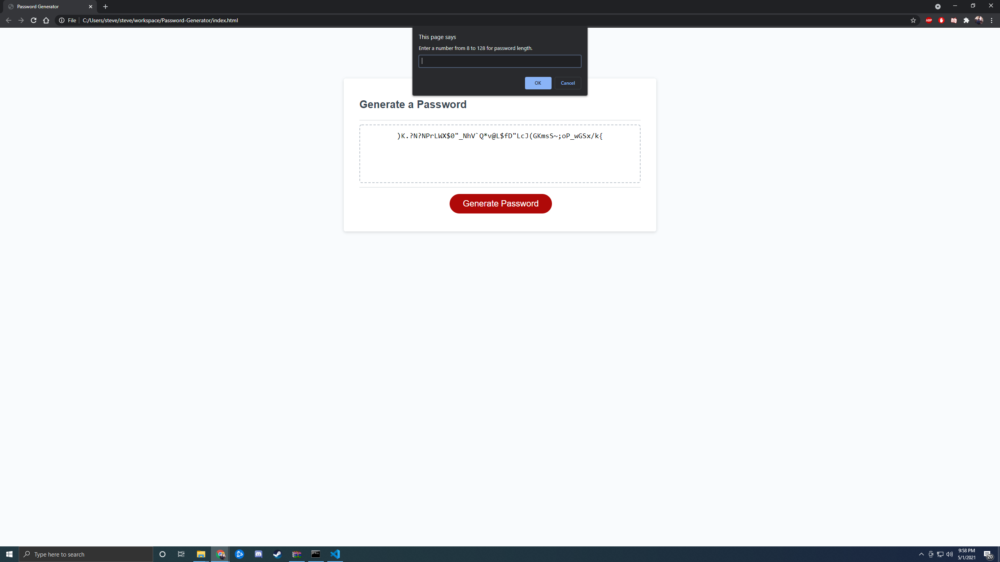
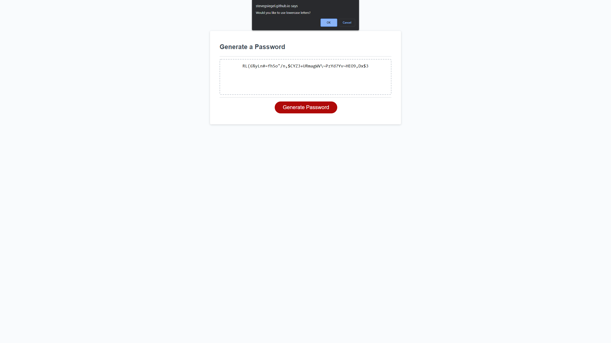

# Password-Generator

## Description

We were tasked with using javascript to create a random password generator. We were provided with already completed html and css. So all we had to do was add the javascript neccesary to provide the required functionality. When the user loads the page they're presented with a series of questions to determine the desired characteristics of their new password. They're able to choose the length of the password between 8 and 128 characters. Then they're able to choose whether or not they would like to include uppercase letters, lowercase letters, numbers, or special symbols in their newly created password. Once the user has answered the questions and chosen they're presented with a randomly generated password matching their desired characteristics. (p.s. for some reason the password wont generate the first time the page loads. once you navigate out of the prompt, and click the "Generate Password" button the generator will behave as intended.)

## License

License: MIT License

Copyright (c) [2021] [steve siegel]

Permission is hereby granted, free of charge, to any person obtaining a copy of this software and associated documentation files (the "Software"), to deal in the Software without restriction, including without limitation the rights to use, copy, modify, merge, publish, distribute, sublicense, and/or sell copies of the Software, and to permit persons to whom the Software is furnished to do so, subject to the following conditions:

The above copyright notice and this permission notice shall be included in all copies or substantial portions of the Software.

THE SOFTWARE IS PROVIDED "AS IS", WITHOUT WARRANTY OF ANY KIND, EXPRESS OR IMPLIED, INCLUDING BUT NOT LIMITED TO THE WARRANTIES OF MERCHANTABILITY, FITNESS FOR A PARTICULAR PURPOSE AND NONINFRINGEMENT. IN NO EVENT SHALL THE AUTHORS OR COPYRIGHT HOLDERS BE LIABLE FOR ANY CLAIM, DAMAGES OR OTHER LIABILITY, WHETHER IN AN ACTION OF CONTRACT, TORT OR OTHERWISE, ARISING FROM, OUT OF OR IN CONNECTION WITH THE SOFTWARE OR THE USE OR OTHER DEALINGS IN THE SOFTWARE.

[Link](https://stevegsiegel.github.io/Password-Generator/)

